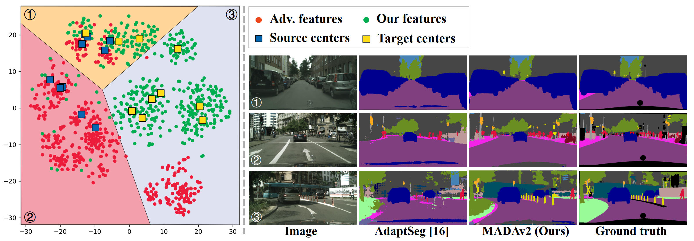

# MADAv2
Project for [MADAv2: Advanced Multi-Anchor Based Active Domain Adaptation Segmentation](https://arxiv.org/abs/2301.07354), which is modified from ICCV Oral 2021 [Multi-Anchor Active Domain Adaptation for Semantic Segmentation](https://arxiv.org/abs/2108.08012), and accepted by TPAMI.

> **Abstract.**
> Unsupervised domain adaption has been widely adopted in tasks with scarce annotated data.
> Unfortunately, mapping the target-domain distribution to the source-domain unconditionally may distort the essential structural information of the target-domain data, leading to inferior performance.
To address this issue, we firstly propose to introduce active sample selection to assist domain adaptation regarding the semantic segmentation task.
> By innovatively adopting multiple anchors instead of a single centroid, both source and target domains can be better characterized as multimodal distributions, in which way more complementary and informative samples are selected from the target domain.
> With only a little workload to manually annotate these active samples, the distortion of the target-domain distribution can be effectively alleviated, achieving a large performance gain.
> In addition, a powerful semi-supervised domain adaptation strategy is proposed to alleviate the long-tail distribution problem and further improve the segmentation performance.
> Extensive experiments are conducted on public datasets, and the results demonstrate that the proposed approach outperforms state-of-the-art methods by large margins and achieves similar performance to the fully-supervised upperbound, *i.e.*, 71.4\% mIoU on GTA5 and 71.8\% mIoU on SYNTHIA.
> The effectiveness of each component is also verified by thorough ablation studies. 

## Table of Contents

- [Requirements](#requirements)
- [Usage](#usage)
- [License](#license)
- [Notes](#notes)

## Requirements

The code requires Pytorch >= 0.4.1 and faiss-cpu >= 1.7.2. The code is trained using a NVIDIA RTX3090 with 24GB memory.

## Usage

1. Preparation:
* Download the [GTA5](https://download.visinf.tu-darmstadt.de/data/from_games/) dataset as the source domain, and the [Cityscapes](https://www.cityscapes-dataset.com/) dataset as the target domain.
* Download the [weights](https://drive.google.com/drive/folders/1Ln-fTBTivmMGJdRiVOi1774eBK_GMrhZ?usp=sharing) and [features](https://drive.google.com/drive/folders/17DMUHU97X5JPnEi9Hx8xWv-YYRDKdfie?usp=sharing). Move features to the MADAv2 directory.

2. Setup the config files.
* Set the data paths
* Set the pretrained model paths

3. Training-quick
* To run the code with our weights and anchors:
~~~~
python3 step1_train_active_sup_only.py
python3 step2_train_active_semi_sup.py
~~~~
* During the training, the generated files (log file) will be written in the folder 'runs/..'.

4. Evaluation
* Set the config file for test (configs/test_from_city_to_gta.yml):
* Run:
~~~~
python3 test.py
~~~~
to see the results.

5. Training-whole process
* Setting the config files.
* Stage 1:
* 1-save_feat_source.py: get the './features/full_dataset_objective_vectors.pkl'
~~~~
python3 save_feat_source.py
~~~~
* 2-cluster_anchors_source.py: cluster the './features/full_dataset_objective_vectors.pkl' to './anchors/cluster_centroids_full_10.pkl'
~~~~
python3 cluster_anchors_source.py
~~~~
* 3-select_active_samples.py: select active samples with './anchors/cluster_centroids_full_10.pkl' to 'stage1_cac_list_0.05.txt'
~~~~
python3 select_active_samples.py
~~~~
* 4-train_active_stage1.py: train stage1 model with anchors './anchors/cluster_centroids_full_10.pkl' and active samples 'stage1_cac_list_0.05.txt', get the 'from_gta5_to_cityscapes_on_deeplab101_best_model_stage1.pkl', which is stored in the runs/active_from_gta_to_city_stage1
~~~~
python3 train_active_stage1.py
~~~~

* Stage 2:
* 1-save_feat_target.py: get the './features/target_full_dataset_objective_vectors.pkl.pkl'
~~~~
python3 save_feat_target.py
~~~~
* 2-cluster_anchors_target.py: cluster the './features/target_full_dataset_objective_vectors.pkl' to './anchors/cluster_centroids_full_target_10.pkl'
~~~~
python3 cluster_anchors_target.py
~~~~
* 3-train_active_stage2.py: train stage2 model with anchors './anchors/cluster_centroids_full_target_10.pkl' and active samples 'stage1_cac_list_0.05.txt', get the 'from_gta5_to_cityscapes_on_deeplab101_best_model_stage2.pkl'
~~~~
python3 train_active_stage2.py
~~~~

## License

[MIT](LICENSE)

The code is heavily borrowed from the CAG_UDA (https://github.com/RogerZhangzz/CAG_UDA).

If you use this code and find it usefule, please cite:
~~~~
@inproceedings{ning2021multi,
  title={Multi-Anchor Active Domain Adaptation for Semantic Segmentation},
  author={Ning, Munan and Lu, Donghuan and Wei, Dong and Bian, Cheng and Yuan, Chenglang and Yu, Shuang and Ma, Kai and Zheng, Yefeng},
  booktitle={Proceedings of the IEEE/CVF International Conference on Computer Vision},
  pages={9112--9122},
  year={2021}
}
~~~~

## Notes
The anchors are calcuated based on features captured by decoders.

In this paper, we utilize the more powerful decoder in DeeplabV3+, it may cause somewhere unfair. So we strongly recommend the [ProDA](https://github.com/microsoft/ProDA) which utilize origin DeeplabV2 decoder.
